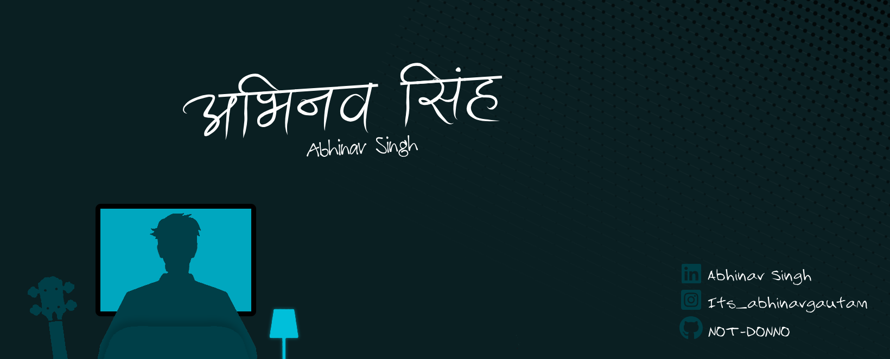

  

  

  

---

## 👨‍💻 About Me

Hi there! I’m **Abhinav Singh**, a passionate self-taught developer who loves building things with code. From web development to experimenting with hardware, I enjoy learning new technologies and turning ideas into reality.

